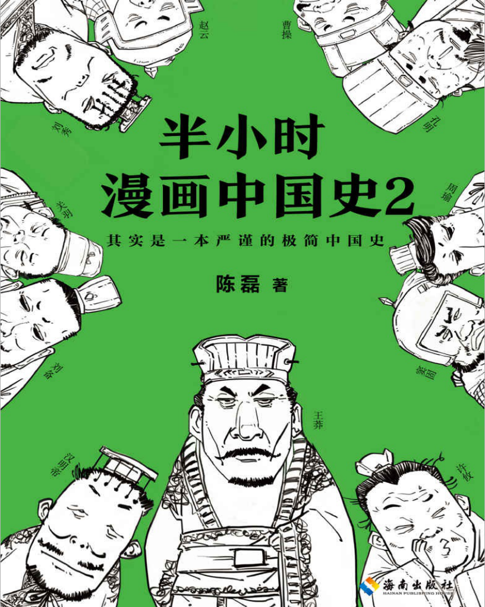
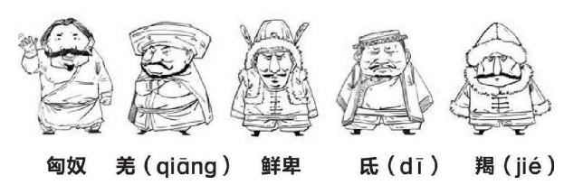

# 《半小时漫画中国史2》——汉朝到两晋  

“汉”就源于当年刘邦的封地陕西汉中

汉景帝，七个姓刘的亲戚组成联盟造反，三个月就被搞定，厉害吧？这事叫作“七国之乱”。

一般来说，中国历史的朝代中，先后分为“西、东”两段的，西指首都在现在的西安，东就指首都在洛阳。

“刘备借荆州，有借无还”。
> 这话其实并不准确：
> 
> 第一，刘备借的是荆州孙权片区的一小块，不是整个荆州。
> 
> 第二，借来的那块是没还，但刘备后来还了两块别的地盘，所以后来孙权来找事儿，不只是因为地盘

> 温馨提示：
> 
> 刘备的故事告诉我们，创业一定要选对合伙人，自己已经是个扫把星，就不要一开始就挑两个兄弟叫“关张”了。

封建帝国，一个人坐龙椅，叫皇帝；一堆亲戚占着全国许多封地，叫王。

### 五胡十六国
